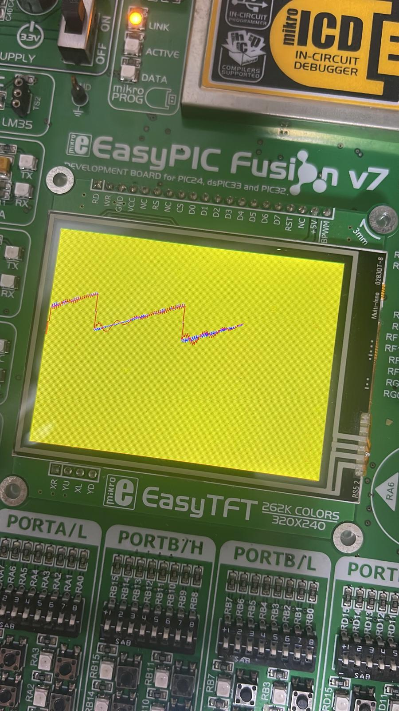
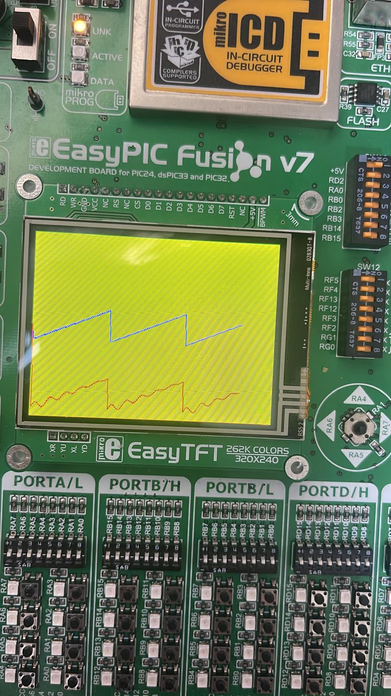

# Notch Filter PIC32 Project

## Table of Contents
- [Overview](#overview)
- [Features](#features)
- [Tools & Technologies](#tools--technologies)
- [What I Learned](#what-i-learned)
- [Screenshots](#screenshots)
- [Source Code](#source-code)
  - [PIC32 Code (EasyPIC Fusion v7)](#pic32-code-easypic-fusion-v7)
  - [Arduino Code](#arduino-code)
- [Project Presentation](#project-presentation)
- [Future Improvements](#future-improvements)
- [Credits](#credits)

---

## Overview
This project implements a **50Hz Notch Filter** using the **PIC32 microcontroller**. The filter removes power line noise (50Hz) from input analog signals and displays both the raw and filtered signals on a **TFT screen** in real time.

## Features
- Real-time sampling at 1kHz
- Timer Interrupt based ADC sampling
- Notch filter implementation for 50Hz noise removal
- Ring Buffer implementation for filter history
- Graphical visualization of signals on TFT

## Tools & Technologies
- mikroC PRO for PIC32
- EasyPIC Fusion v7 Board
- ILI9341 TFT Display
- MATLAB (for filter coefficient calculation)
- Arduino IDE (alternative implementation)

## What I Learned
- Purpose and implementation of a **Notch Filter** to eliminate unwanted frequencies (e.g. 50Hz mains noise)
- Using **Ring Buffers** for digital filter implementation
- Working with **Timer Interrupts** for precise sampling intervals
- Calculating digital filter coefficients using MATLAB

## Screenshots

### Raw vs. Filtered Signal – Overlapping Display
- **Blue Line:** Filtered signal (Notch filter output)
- **Red Line:** Unfiltered signal (raw input)

---

### Raw vs. Filtered Signal – Separate Display
- **Blue Line:** Filtered signal (Notch filter output)
- **Red Line:** Unfiltered signal (raw input)

---

## Source Code

### PIC32 Code (EasyPIC Fusion v7)

This code implements the notch filter on a PIC32 using mikroC PRO. It samples the analog signal, processes it with a digital notch filter, and displays the output on a TFT screen.

➡️ **File:** [PIC32 Code](src/HW01.c)

### Arduino Code
The Arduino code implements a sawtooth signal generator for testing and comparison with the PIC32 filter.

➡️ **File:**: [Arduino Code](src/SAWTOOTH.ino)

## Project Presentation

A detailed presentation (in Hebrew) explaining the design, calculations, and implementation of the 50Hz Notch Filter project is available [here](docs/notch_filter_presentation.pdf).

**Includes:**
- Purpose and theory of notch filters
- MATLAB calculations for filter coefficients
- EasyPIC and Arduino implementations
- TFT visualization examples

---

## Future Improvements
- Extend to multiple notch frequencies
- Implement dynamic frequency adjustment via user interface
- Optimize TFT drawing routines for faster refresh

---

## Author

Developed by Yehonatan Levi as part of the Real-Time DSP (RT DSP) course, 2025.

- [GitHub](https://github.com/yonilevi1)
- [LinkedIn](https://www.linkedin.com/in/yehonatan--levi/)
